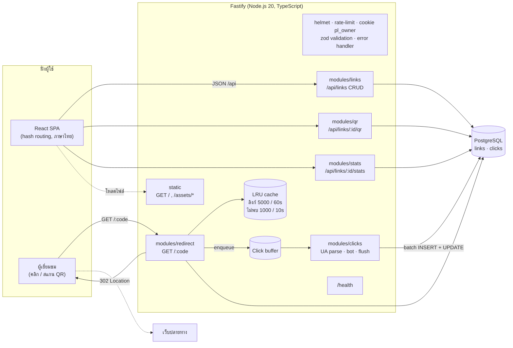
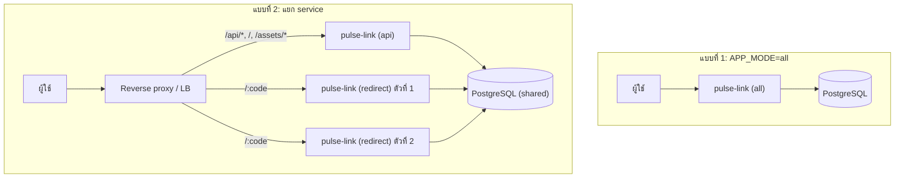
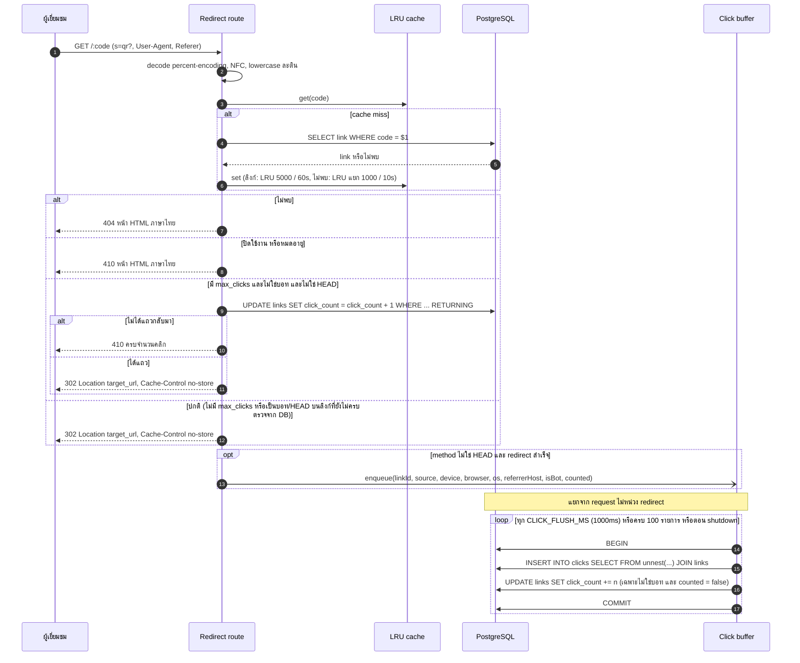
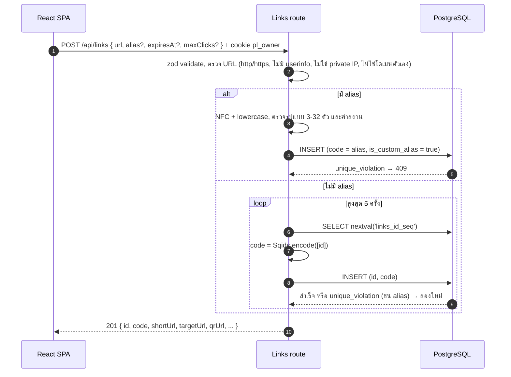

# Architecture — Pulse Link

Pulse Link เป็น **modular monolith**: โค้ดชุดเดียว แบ่งโมดูลตามฟีเจอร์ชัดเจน และเลือกบทบาทของโปรเซสได้ด้วย `APP_MODE`
จึง deploy เป็นโปรเซสเดียว (ง่าย, free host) หรือแยกเป็น 2 service (API กับ Redirect) ที่ใช้ฐานข้อมูลเดียวกันได้โดยไม่ต้องแก้โค้ด

## 1. ภาพรวม



### โครงสร้างโค้ด

```
src/
  app.ts                 buildApp({ mode }) ลงทะเบียน plugin/route ตาม APP_MODE
  server.ts, main.ts     เริ่ม server ตาม APP_MODE + ผูก SIGTERM/SIGINT กับ graceful shutdown
  entry/{all,api,redirect}.ts   จุดเริ่มที่บังคับโหมด
  scripts/migrate.ts     runner ของ db/migrations
  shared/                config (zod), db (pg Pool), errors + error handler, validation (zod → 400), migrate, code generator (Sqids),
                         url validator, alias normalizer, owner cookie, html escape/หน้า 404, lru, bot detection
  modules/
    links/               CRUD
    redirect/            LinkCache (2 LRU), resolver (cache → DB, atomic max_clicks), หน้า 410
    clicks/              ua-parser (device/browser/os), ClickBuffer + flush SQL
    qr/                  PNG/SVG
    stats/               query สถิติ (Asia/Bangkok)
db/migrations/           SQL ธรรมดา + runner
web/                     React + Vite (build แล้ว Fastify เสิร์ฟ)
```

แต่ละโมดูลเป็น Fastify plugin ที่ไม่ import ภายในของกันและกัน ยกเว้นผ่าน interface ที่ประกาศไว้
(`redirect` → `ClickBuffer.enqueue`, `links` → `cache.invalidate`) จึงย้ายไปอยู่คนละ service ได้

## 2. โหมดการรัน (APP_MODE)

| โหมด | Route ที่เปิด | ใช้เมื่อ |
|---|---|---|
| `all` (ค่าเริ่มต้น) | `/api/*`, static (`/`, `/assets/*`), `/:code`, `/health` | deploy โปรเซสเดียว / `docker compose up` |
| `api` | `/api/*`, static, `/health` | service จัดการลิงก์ + หน้าเว็บ |
| `redirect` | `/:code`, `/health` | service redirect ที่ scale แยกได้ (hot path) |



ข้อจำกัดเมื่อแยก: cache และ click buffer อยู่ในหน่วยความจำของแต่ละโปรเซส
การแก้/ลบลิงก์ผ่าน API จึงอาจยังเห็นค่าเก่าใน redirect service ได้ไม่เกิน TTL 60 วินาที
(ลิงก์ที่มี `max_clicks` ไม่ได้รับผลเพราะตัดสินที่ DB เสมอ) — ดู [DECISIONS.md](DECISIONS.md)

## 3. Flow การ redirect และบันทึกคลิก



### ประเด็นสำคัญ

- **302 เท่านั้น** + `Cache-Control: no-store`: 301 ถูกเบราว์เซอร์ cache ทำให้คลิกครั้งต่อไปไม่ผ่านระบบและนับไม่ได้
- **ไม่หน่วง redirect**: การบันทึกคลิกเป็นแค่การ push ลง array ในหน่วยความจำ งาน DB ทำทีหลังแบบ batch
- **max_clicks แบบ atomic**: ใช้ UPDATE คำสั่งเดียวที่มีเงื่อนไข `click_count < max_clicks` ให้ PostgreSQL row lock
  ตัดสินกรณีคลิกพร้อมกัน ไม่ใช้ cache; buffer entry มีธง `counted=true` เพื่อไม่ให้ flush บวกซ้ำ
- **บอท** (ตัว preview ของแอปแชต, crawler): บันทึกเป็น `is_bot=true` ไม่เพิ่ม `click_count` ไม่กินโควตา `max_clicks`
- **HEAD** ตอบเหมือน GET แต่ไม่บันทึกคลิก
- **ลิงก์ถูกลบก่อน flush**: `JOIN links` ตัดแถวกำพร้าทิ้ง ไม่ให้ FK ทำให้ทั้ง batch ล้ม
- **DB ล่มตอน flush**: คืนรายการเข้า buffer (มีเพดาน) แล้วลองใหม่รอบถัดไป
- **Graceful shutdown** (SIGTERM/SIGINT): `app.close()` หยุดรับ request และรอ request ที่ค้างอยู่ →
  hook `onClose` flush buffer จนหมด (ให้เวลาสูงสุด 5 วินาที ถ้า DB ไม่ตอบให้ log จำนวนที่เสียแล้วปิดต่อ) → `db.end()` → exit
- **Negative cache แยก LRU**: code ที่ไม่พบเก็บใน LRU ของตัวเอง (1000 รายการ) การสุ่มเดา code จึงดันลิงก์จริงออกจาก cache ไม่ได้
- **ลำดับ route**: find-my-way ให้ route แบบ static (`/health`, `/api/*`, `/assets/*`) ชนะ `/:code` เสมอไม่ว่าลงทะเบียนก่อนหลัง
  และ `/:code` จับได้แค่ 1 segment; `/`, `/api`, `/favicon.ico` ที่ตกมาถึง `/:code` ตอบ 404 โดยไม่แตะ DB
- **percent-encoding เสีย** (`/%E0%B8`): `frameworkErrors` ตอบหน้า 404 ภาษาไทยเดียวกับกรณีไม่พบ ไม่เผยข้อความของ Fastify
- **Error นอก /api** เป็นหน้า HTML ภาษาไทย ส่วนใต้ `/api` เป็น JSON `{ error: { code, message } }`

## 4. Flow การสร้างลิงก์



## 5. การจัด route ไม่ให้ชนกัน

- `/:code` จับเพียง 1 segment; route แบบคงที่ (`/health`, `/`, `/favicon.ico`, `/robots.txt`) มีลำดับความสำคัญสูงกว่า parametric ใน find-my-way
- ไฟล์ build ของ Vite เสิร์ฟที่ prefix `/assets/` (หลาย segment จึงไม่ตก `/:code`) และไม่มี SPA fallback เพราะใช้ hash routing
- alias ห้ามใช้คำสงวน `api, health, assets, favicon.ico, robots.txt, admin, app, static`
- ตั้ง `maxParamLength` ให้รองรับ alias ไทยที่ percent-encode แล้ว (ไทย 1 ตัว = 9 ตัวอักษรใน URL)

## 6. ความปลอดภัย

- `@fastify/helmet`, ไม่เปิด CORS (same-origin), rate limit: `POST /api/links` 30/นาที/IP และ `/api` รวม 300/นาที/IP (รองรับ `TRUST_PROXY`)
- ความเป็นเจ้าของผ่าน cookie `pl_owner` (UUID, httpOnly, SameSite=Lax, Secure ใน production); ลิงก์ของคนอื่นตอบ 404 เพื่อไม่เปิดเผยการมีอยู่
- SQL แบบ parameterized ทั้งหมด, escape HTML ทุกหน้าที่ server เรนเดอร์ (404/410)
- ตรวจ URL ปลายทางเพื่อกัน open redirect ไปยังเครือข่ายภายในและกัน redirect วนกลับมาที่ระบบเอง
