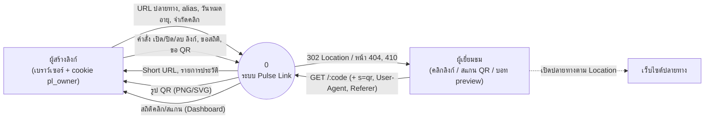
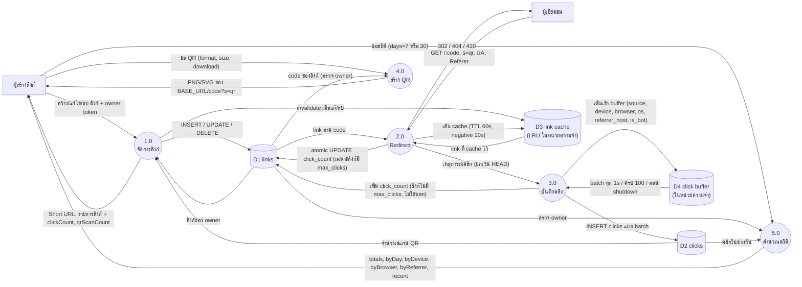

# Data Flow Diagram — Pulse Link

สัญลักษณ์ (วาดด้วย Mermaid flowchart):
สี่เหลี่ยม = External Entity, วงกลม = Process, ทรงกระบอก = Data Store

## DFD Level 0 (Context Diagram)

ระบบไม่ติดต่อเว็บปลายทางโดยตรง (ไม่ fetch, ไม่ resolve DNS) เพียงส่ง `Location` ให้เบราว์เซอร์ของผู้เยี่ยมชมไปเอง

## DFD Level 1

### คำอธิบาย Process

| # | Process | Endpoint | สรุป |
|---|---|---|---|
| 1.0 | จัดการลิงก์ | `POST/GET/PATCH/DELETE /api/links[/:id]` | ตรวจ URL, normalize alias (NFC + lowercase), สร้าง code ด้วย Sqids จาก `nextval`, ตรวจ owner (ไม่ตรง → 404) |
| 2.0 | Redirect | `GET /:code`, `HEAD /:code` | decode + NFC → cache → DB; ไม่พบ 404, ปิด/หมดอายุ/ครบจำนวน 410, พบ 302 + `Cache-Control: no-store` |
| 3.0 | บันทึกคลิก | (ภายใน) | แยก UA ด้วย ua-parser-js, ตรวจบอท, เก็บเฉพาะ hostname ของ Referer, flush แบบ batch ไม่หน่วง redirect |
| 4.0 | สร้าง QR | `GET /api/links/:id/qr` | เข้ารหัส `${BASE_URL}/${encodeURIComponent(code)}?s=qr`, error correction M, margin 2 |
| 5.0 | คำนวณสถิติ | `GET /api/links/:id/stats` | จัดกลุ่มวันตาม Asia/Bangkok, เติมวันว่างเป็น 0, ไม่รวมบอท (แยกใน totals.bots) |

### Data Store

| # | Store | ชนิด | หมายเหตุ |
|---|---|---|---|
| D1 | links | PostgreSQL | ดู [ER.md](ER.md) |
| D2 | clicks | PostgreSQL | ดู [ER.md](ER.md) |
| D3 | link cache | หน่วยความจำต่อโปรเซส | สูงสุด 5000 รายการ, TTL 60s, negative cache 10s; ไม่ใช้ตัดสินลิงก์ที่มี `max_clicks` |
| D4 | click buffer | หน่วยความจำต่อโปรเซส | อาจเสียคลิกได้ไม่เกินช่วง flush หากโปรเซส crash |
