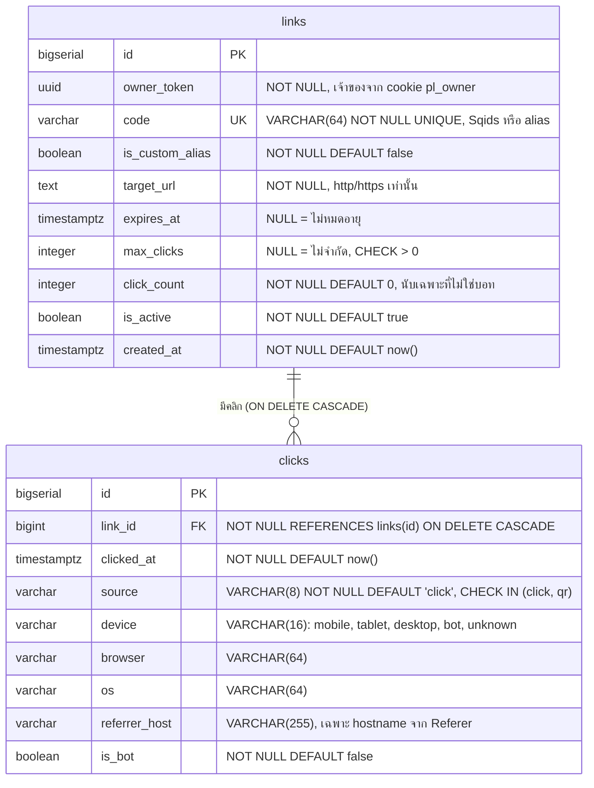

# ER Diagram — Pulse Link

ตรงกับ `db/migrations/001_init.sql` (ตาม SPEC §3) ทุกคอลัมน์, constraint และ index

## Index

| ตาราง | Index | ใช้กับ |
|---|---|---|
| links | `links_pkey (id)` | หา link ตาม id, atomic UPDATE ของ `max_clicks` |
| links | `links_code_key (code)` UNIQUE | redirect `GET /:code`, กันซ้ำ alias/code |
| links | `idx_links_owner (owner_token, created_at DESC)` | หน้าประวัติ `GET /api/links` (cursor, ใหม่สุดก่อน) |
| clicks | `clicks_pkey (id)` | — |
| clicks | `idx_clicks_link_time (link_id, clicked_at DESC)` | stats ตามช่วงวัน, คลิกล่าสุด 20 รายการ, นับ qrScanCount |

## หมายเหตุ

- ความสัมพันธ์: link หนึ่งมีคลิกได้ 0..n แถว ลบ link แล้วคลิกถูกลบตาม (`ON DELETE CASCADE`)
- `click_count` เป็นค่าสะสม (denormalized) เพื่อให้หน้าประวัติและการตรวจ `max_clicks` ไม่ต้อง `COUNT(*)`
  - ลิงก์ที่มี `max_clicks`: เพิ่มทันทีตอน redirect ด้วย atomic UPDATE
  - ลิงก์ที่ไม่มี `max_clicks`: เพิ่มแบบ batch ตอน flush click buffer
- `qrScanCount` ในรายการลิงก์คำนวณจาก `clicks` (`source = 'qr' AND NOT is_bot`) ไม่ได้เก็บเป็นคอลัมน์
- `id` ของ link ที่ไม่ใช่ alias มาจาก `nextval('links_id_seq')` ก่อน INSERT แล้วนำไปสร้าง `code` ด้วย Sqids
